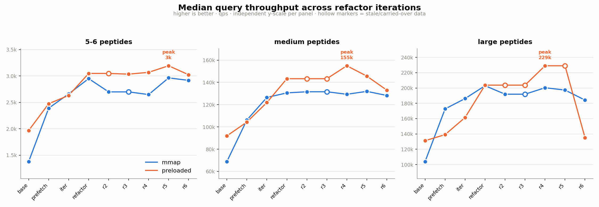

> **Historical record.** Captured during the performance work that landed on
> `feature/preloaded-sa-improvements`, and preserved verbatim as the rationale behind
> decisions now encoded in the code. Measurements are pinned to the `cleanup-baseline`
> tag and to the machine and index named below; they are not re-run by CI and will drift.
> Where a conclusion is load-bearing it is also stated as a comment at the code it explains.

# Refactor iteration comparison

Comparing the benchmark snapshots in `benchmarks/*/` by the `commit` hash embedded in
each `*.jsonl` line, cross-referenced against the git history (44 commits span
`base` → `refactor6`).

Numbers are **median `throughput_qps`** over the 100 runs per bucket. `medium` is the
most reliable spine: it was always re-run at the folder's headline commit.

## Iteration → commit map

| folder | mmap commit | preloaded commit | headline git message |
|---|---|---|---|
| base | `da82ea6` | `da82ea6` | add warmup |
| prefetch | `bc62321` | `bc62321` | Remove iter fast-path (prefetch + mmap guard isolation) |
| iter | `18705e5` | `c9555d3` | Ranged iterator for the bitarray |
| refactor | `9ab689a` | `ade110b` | Small fix to preload suffix array |
| refactor2 | `ade110b` | `ade110b` | *(same commit as refactor)* |
| refactor3 | `ade110b` | `ade110b`* | *(same commit; only preloaded `5-6` re-run at `8e34f34`)* |
| refactor4 | `d0d9a3f` | `d0d9a3f` | Extra cfg filtering to keep inline fns small |
| refactor5 | `2eb8b95` | `116fcf8`* | Further split mmap / InMemory functionality |
| refactor6 | `d03760a` | `d03760a` | Consistency additions for suffix_to_protein_mappings |

\* **Stale cells:** `refactor5/preloaded/large.jsonl` was *not* re-run — it still holds
`refactor4` (`d0d9a3f`) data, so the "large +0%" there is meaningless.
`refactor2` and `refactor3` are code-identical to `refactor`.

## Throughput (median qps, Δ vs previous)

### mmap
| iter | commit | 5-6 | medium | large |
|---|---|---|---|---|
| base | `da82ea6` | 1,382 | 68,917 | 104,019 |
| prefetch | `bc62321` | 2,390 (+73%) | 106,230 (+54%) | 172,697 (+66%) |
| iter | `18705e5` | 2,660 (+11%) | 126,476 (+19%) | 186,165 (+8%) |
| refactor | `9ab689a` | 2,950 (+11%) | 130,566 (+3%) | 202,938 (+9%) |
| refactor2/3 | `ade110b` | 2,698 (-9%) | 131,597 (+1%) | 191,896 (-5%) |
| refactor4 | `d0d9a3f` | 2,648 (-2%) | 129,325 (-2%) | 200,297 (+4%) |
| refactor5 | `2eb8b95` | 2,963 (+12%) | 131,934 (+2%) | 197,302 (-1%) |
| refactor6 | `d03760a` | 2,916 (-2%) | **128,258 (-3%)** | **184,171 (-7%)** |

### preloaded
| iter | commit | 5-6 | medium | large |
|---|---|---|---|---|
| base | `da82ea6` | 1,968 | 91,940 | 131,167 |
| prefetch | `bc62321` | 2,475 (+26%) | 104,366 (+14%) | 139,084 (+6%) |
| iter | `c9555d3` | 2,631 (+6%) | 121,900 (+17%) | 161,446 (+16%) |
| refactor | `ade110b` | 3,047 (+16%) | 143,322 (+18%) | 203,722 (+26%) |
| refactor2/3 | `ade110b` | 3,047 (0%) | 143,322 (0%) | 203,722 (0%) |
| refactor4 | `d0d9a3f` | 3,068 (+1%) | **154,956 (+8%)** | 229,011 (+12%) |
| refactor5 | `116fcf8` | 3,193 (+4%) | **145,652 (-6%)** | *(stale)* |
| refactor6 | `d03760a` | 3,023 (-5%) | **133,061 (-9%)** | **135,122 (-41%)** |

Peak preloaded throughput = **refactor4**; peak mmap ≈ **refactor5 / refactor**.

## Where the time went (mmap, medium bucket, median ms)

| iter | total | search | retrieval | search_bounds | match_iter |
|---|---|---|---|---|---|
| base | 145.1 | 52.5 | 91.4 | 406 | 194 |
| prefetch | 94.1 | 48.9 | 45.3 | 336 | 217 |
| iter | 79.1 | 34.4 | 43.9 | 284 | 102 |
| refactor | 76.6 | 33.8 | 42.1 | 202 | 108 |
| refactor4 | 77.3 | 30.4 | 45.9 | 165 | 104 |
| refactor5 | 75.8 | 34.0 | 41.3 | 190 | 108 |
| refactor6 | 78.0 | 36.3 | 39.8 | 223 | 103 |

- `prefetch` **halved retrieval** (91→45 ms) — the OS page-cache prefetching win.
- `iter` **halved match_iter** (217→102 ms) — the ranged bitarray iterator.

## What each step actually changed (code)

**base → prefetch** `da82ea6→bc62321` — *biggest win* (+54–66% mmap). `+1011/−213`
- New `prefetch/` crate + OS page-cache prefetching of proteins, text, and SA ranges.
- New `sa-index/src/kmer_table.rs` (250 lines) — k-mer bounds cache.
- `sa-index/src/array/mmap.rs` prefetch hooks; heavy `sa_searcher.rs` rework.

**prefetch → iter** `bc62321→c9555d3` — +8–19% mmap. `+123/−18`
- Ranged iterator for the bitarray (`bitarray/src/lib.rs` +87).
- `is_mmap_backend` guard to skip no-ops; iterator size hints.

**iter → refactor (=r2=r3)** `c9555d3→ade110b` — +3–11% mmap, **+16–26% preloaded**. `+571/−290`
- Two-pass prefetching for the preloaded index (proteins + suffix array).
- Removed all unsafe code except unavoidable mmap; reordered OS-page prefetch calls.
- `mmap` compile-flag separation; k-mer prefetch when skip > 0.
- ⚠️ `refactor2`/`refactor3` add **no code** over `refactor`.

**refactor → refactor4** `ade110b→d0d9a3f` — flat mmap, **+8–12% preloaded** (peak). `+70/−7`
- Pivot prefetching for the preloaded index.
- `cfg` filtering to keep inlined functions small; mmap warmup fix.

**refactor4 → refactor5** `d0d9a3f→116fcf8` — flat mmap, **−6% preloaded medium**. `+1548/−2199`
- "Massive rewrite" splitting mmap from the InMemory variant into separate files
  (`array/{compressed,mmap,preloaded}.rs`, `proteins/{mmap,preloaded}.rs`,
  `text-compression/{mmap,preloaded}.rs`).
- A **cleanliness/structure refactor that cost preloaded throughput**.

**refactor5 → refactor6** `116fcf8→d03760a` — **−3–7% mmap, −9% preloaded**. `+152/−192`
- `suffix_to_protein_index` "consistency" refactor: route everything through the
  read/write traits, move mmap reading code into the mmap files.
- **Regressed across the board** — cleaner traits, measurably slower.
- **Root cause (investigated): the regression is NOT in the query hot path.** The
  entire diff is serialization (`write_binary` trait impls), mmap *loading*
  (`read_*_mmap`), the build path (`sa-builder/main.rs`), and tests. Grepping the
  diff for `suffix_to_protein` / `search` / `retrieve` / `#[inline]` hot-path
  changes returns **nothing**; the bitvec `suffix_to_protein()` lookup used by the
  benchmarks is byte-for-byte unchanged. The `text-compression/preloaded.rs` change
  is inside `ReadBinary` (a one-time startup load), not per-query.
- Corroborating signal: `search_bounds_ns` (the k-mer bounds lookup) rose 190→223 ms
  on mmap medium even though `kmer_table.rs` was **not touched** — a timing shift on
  unchanged code.
- **Conclusion:** the r6 slowdown is almost certainly measurement environment
  (thermal/background load when it was run) and/or code-layout/inlining drift from
  the surrounding refactor — not an algorithmic cost. **Recoverable:** re-run r5 and
  r6 back-to-back on a quiet machine to confirm; there is likely nothing in the code
  to "fix." The one genuinely code-driven regression is **r5** (the mmap/InMemory
  file split *did* reorganize the hot SA-access path), worth ~6% on preloaded.

## Re-run: r5 vs r6 back-to-back (2026-07-30)

Settled the r6 question empirically. Both commits (`116fcf8`, `d03760a`) were rebuilt
and run **back-to-back on the same machine** against the **swissprot** index
(`uniprot-2026-01/suffix-array`, 104M suffixes, bitvec mapping) with an identical
deterministic query set (`peptides_5_50.txt`, 10k peptides × 100 runs). Runs were
interleaved **ABBA** per backend to cancel thermal/scheduling drift; both commits
returned identical work (22,662,750 suffix hits).

| backend | r5 median qps | r6 median qps | Δ (r6 vs r5) |
|---|---|---|---|
| preloaded | 734,189 | 733,276 | **−0.1%** |
| mmap | 727,204 | 724,313 | **−0.4%** |

Warm-state (median of the fastest 50% of runs): preloaded **+0.3%**, mmap **+0.6%**
(r6 marginally *faster*). All differences sit well inside the p25–p75 spread (~±3%).

**→ r5 and r6 are statistically indistinguishable.** This confirms the code analysis:
the historical −9% / −41% "r6 regression" was **not** caused by the commit — it was
cross-session measurement variance (the historical r5 and r6 folders were benchmarked
in separate runs). The refactor is safe to keep.

### Full-DB confirmation (`uniprot-2025-04` — the same DB the history was run on)

Repeated the identical ABBA protocol on the **full 242 GB index** with a full
1,000,000-peptide warmup — removing the swissprot-scale caveat entirely. r4/r5/r6
plus a later checkpoint **r7 = `f85614e`** ("Cleanup bitarray + MASK constant",
15 commits past r6) were measured, n=200 each:

| backend | r4 | r5 | r6 | r7 | r4→r5 | r5→r6 | r6→r7 |
|---|---|---|---|---|---|---|---|
| preloaded | 33,660 | 33,232 | 33,836 | **37,204** | −1.3% | +1.8% | **+10.0%** |
| mmap | 30,590 | 31,300 | 30,992 | **32,279** | +2.3% | −1.0% | **+4.2%** |

**r4→r5→r6 are noise** — all within ±2.3%, p25–p75 bands overlapping almost
completely (preloaded r4 32.0k–34.9k, r5 32.0k–34.6k, r6 32.4k–35.3k — the same
distribution three times); the signs even contradict the historical narrative
(history had r4→r5 −6% preloaded, r5→r6 −9%). None of those "regressions" are real.

**r6→r7 is a genuine speedup.** Preloaded +10.0% with **non-overlapping** bands
(r6 32.4k–35.3k vs r7 35.7k–38.7k — r7's p25 exceeds r6's p75), and mmap +4.2%.

Mechanism (verified in the code): r7 adds a **const-generic** `BitArray<const BITS>`
(`bitarray::constant`, `const MASK = u64::MAX >> (64 - BITS)`) and applies it to the
in-memory protein **text**, which is `BitArray<5>` (amino acids = 5 bits). `text.get()`
therefore compiles with `BITS = 5` baked in — `index*5`, `/64`, `%64`, the shift
amounts and the mask all fold to constants — and is `#[inline]` across the crate
boundary. That getter is the hottest one in the search: `compare()` runs on every
binary-search step and walks the suffix character-by-character
(`… == normalize_li(text.get(i_text))`).

Why preloaded gains and mmap barely does:
- Only the **preloaded** text is `BitArray<5>`. The **mmap** text is read from the
  memory-mapped file via a separate path that still uses a runtime bit width and is
  bottlenecked by memory access, not getter arithmetic — so the const-fold doesn't
  apply and wouldn't help much anyway. mmap's +4.2% is from the general cross-crate
  `#[inline]` additions both backends received, not the const specialization.
- The **suffix array** is const-specialized in *neither* backend: its `bits_per_value`
  varies per index (28/37 bits), so it stays a runtime `DynBitArray` (preloaded) /
  runtime mmap reader — both only gained `#[inline]` in r7. (So the win is the *text*
  getter, not the SA getter.)

This is the first real query-path win since the early `prefetch`/`iter`/`refactor`
gains. *Opportunity:* giving the mmap text an equivalent const-`BITS=5` getter could
close part of the gap, though mmap's memory-access cost likely caps the upside.

**Experiment — `MADV_HUGEPAGE` for the mmap regions (full DB): no effect.**
Env-gated `madvise(MADV_HUGEPAGE)` at the four mmap load sites, A/B back-to-back:
baseline 31,382 vs huge-pages 31,221 qps (**−0.5%**, bands fully overlap). Expected
in hindsight: `MADV_HUGEPAGE` targets *anonymous*/tmpfs memory, but the index is a
**file-backed** mmap on an ordinary FS, where THP is not delivered via `madvise` on
most kernels — so the mapping stayed on 4 KB pages and TLB pressure was unchanged.
Huge pages are not the mmap lever (they'd apply to the anonymous-`Vec` *preloaded*
backend instead). The real mmap lever remains **cross-query batching for memory-level
parallelism** — overlapping the random text/SA DRAM misses across independent queries,
which is the actual bottleneck huge pages never touched.

*(Caveat: r7 was measured in a later session than the reused r4/r5/r6, so r6→r7 carries
the cross-session caveat — but +10% is far outside the ~2% cross-session noise seen
among r4/r5/r6, and the preloaded bands don't overlap, so it is very likely real. A
back-to-back r6-vs-r7 run would make it airtight.)*

*(Absolute qps here (~33k) is lower than the historical per-bucket medium/large
numbers because `peptides_5_50.txt` mixes in very short 5–6-mers that hit the
10k-match cutoff — a harder blended workload, not a regression.)*

**Build note for reproducing:** at r4, `sa-benchmarks/Cargo.toml` has
`default = ["mmap"]` (flips to `[]` at r5), so the preloaded binary must be built with
`--no-default-features` or it silently compiles the mmap variant. See
`benchmarks/rerun_r5_r6.sh`.

## Verdict

**Made it faster**
- OS page-cache prefetching + k-mer bounds cache (`prefetch`) — by far the largest gain.
- Ranged bitarray iterator (`iter`) — halved match-iteration time.
- Two-pass + pivot prefetching for the preloaded index (`refactor` → `refactor4`).
- **Const-generic `BitArray<5>` for the in-memory protein text + cross-crate getter
  inlining (`r6`→`r7`, `f85614e`)** — **preloaded +10%, mmap +4.2%**. Compile-time
  `BITS=5` folds the shift/mask in `text.get()`, the hottest getter in `compare()`;
  only preloaded's text is `BitArray<5>` (mmap reads text from the mapping), hence the
  split. First real query-path win after the early prefetch/iter gains.

**Made it slower**
- Nothing confirmed. Both historical suspects were **cleared** by back-to-back re-runs:
  - ~~`refactor5` mmap/InMemory file split (~6% preloaded)~~ — full-DB r4→r5 is −1.3%
    preloaded / **+2.3% mmap**, i.e. noise.
  - ~~`refactor6` suffix_to_protein_index refactor (−9% / −41%)~~ — full-DB r5→r6 is
    +1.8% preloaded / −1.0% mmap, i.e. noise; the hot path is provably unchanged.

The r4/r5/r6 structural + consistency refactors are **throughput-neutral** — they
bought code cleanliness for free. The apparent "high-water mark at refactor4" in the
historical per-bucket data was measurement variance, not a real peak. All of the
genuine speedups came earlier: **prefetch → iter → refactor** (≈2× over `base`).
